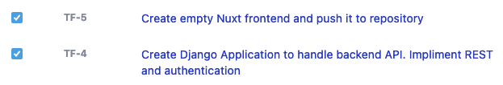

# Sprint 03

## Overview

End Date: Oct 25, 2021
Estimated Hours for this sprint: 4
Availability Notes: No Availability Concerns
Metric to evaluate each other on during the retrospective: Availability/Willingness to participate
Scrum Master: Stephen Beckstrand

## Stories

### Story 1: Create backend to handle API requests for retreiving and storing data in DB

Tasks: 
- Create Django Instance
- Create Models
- Setup routing for endpoints for each model type

### 2) Create frontend framework in Nuxt

Tasks: 
- Install and include nuxt in repository
- Ensure boostrap CSS framework is working
- Create a couple blank pages to ensure routing works properly

## Sprint Backlog

