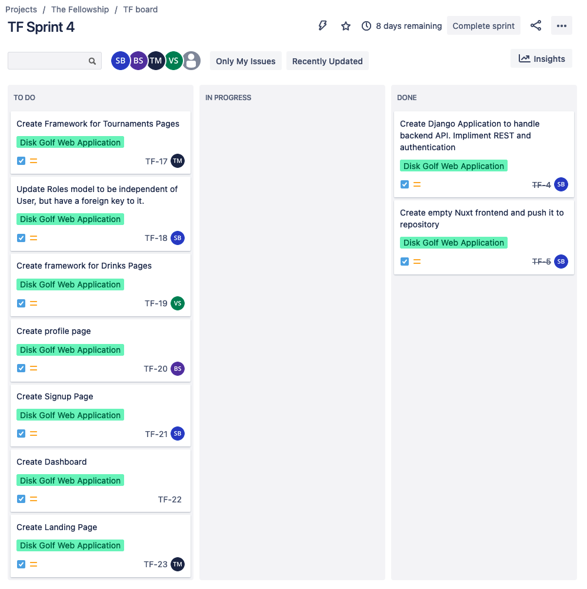

# Sprint 04

## Overview

End Date: Nov 8, 2021
Estimated Hours for this sprint: 40
Availability Notes: No Availability Concerns
Metric to evaluate each other on during the retrospective: Availability/Willingness to participate
Scrum Master: Stephen Beckstrand

## Stories

### Story 1: Create Landing Page

Tasks: 
- Create Index page for `/` . 
- Have landing page include Login and Sign buttons

### Story 2: Create Dashboard Page

Tasks:
- Include details about active tournament if participating. 
- If not participating in tournament, list active tournament(s) that can be engaged
- Give option to update score for holes of active tournament

### Story 3) Create Signup Page

Tasks: 
- Configure Backend to handle new user creation/data validation
- Setup form component on frontend to submit data
- Setup page on frontend to list signup form at `/signup`

### Story 4) Create Profile page

Tasks:
- Create index for profile page at `/profile`
- Create index page for specific profile at `profile/<id>`
- For current user on Profile page, list details about current user
- For specific user page, list details about that user. This will eventually be limited to manager. 

### Story 5) Create Drinks Page

Tasks:
- Create index page for available drinks at `/drinks`
- Create page to create new drinks at `/drinks/create`

## Sprint Backlog

