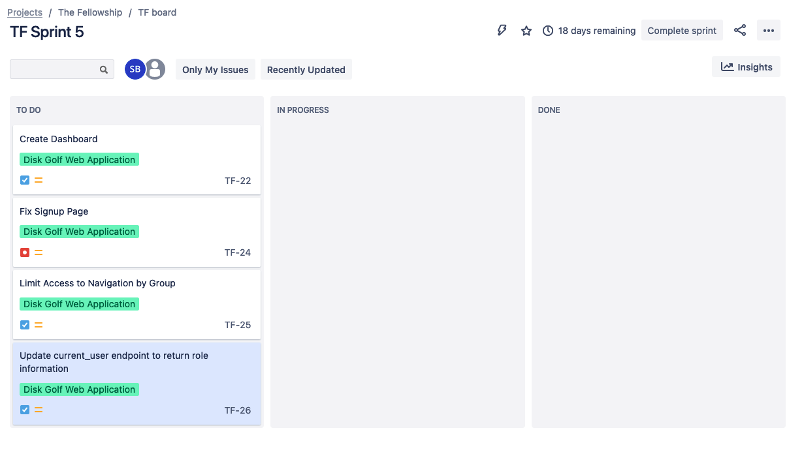

# Sprint 05

## Overview

End Date: Nov 22, 2021
Estimated Hours for this sprint: 15
Availability Notes: No Availability Concerns
Metric to evaluate each other on during the retrospective: Availability/Willingness to participate
Scrum Master: Stephen Beckstrand

## Stories

### Story 1) Create Dashboard Page

Tasks:
- Include details about active tournament if participating. 
- If not participating in tournament, list active tournament(s) that can be engaged
- Give option to update score for holes of active tournament

These tasks were not completed during Sprint 4 and were carried over

### Story 2) Update `current_user` endpoint to return role information

Tasks
- Update backend response to also include roles user is member of

### Story 3) Limit Navigation Access by Roles

Tasks
- Update the navigation to only list items relative to the roles assigned to the logged in user. 

## Sprint Backlog

