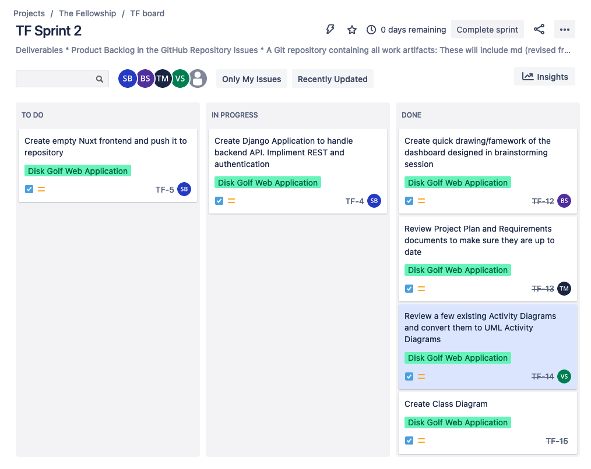

# Sprint 2 Requirements/Deliverables: 

### Product Backlog in the GitHub Repository Issues

#### Requirement 1: 10+ items
I get the impression that this requirement is mostly for project task assignment/handling. Our team has actually been assinging tasks and tracking sprints in JIRA instead of GitHub. However, some issues have been created to ensure we meet this requirement. 

[Issues Page](https://github.com/sbeckstrand/cs-3450-disk-golf/issues)

#### Requirement 2: items small enough to be completed by 1 person in 1-2 workdays

Each of the items listed should be small enough to handle by a single person in this timeline. If you dock us points for this requirement, it will be a direct insult to our competence. I hope you realize that. 

### README.md

#### Requirements: 

1. An explanation of the organization and name scheme for the workspace
2. Version-control procedures
3. Tool stack description and setup procedure
4. Build instructions
5. Unit testing instructions
6. System testing instructions

All of this informaiton should be included excluding the unit and system testing as we have not reached this state yet. There are also not any steps for frontend deployment as this does not yet exist. 

[Link to README](/README.md)

### Project Plan

#### Requirements

1. A summary of the project being built
2. A description of team organization
3. Policies, procedures, or tools for communication
4. Risk Analysis

All of this information should be included. 

[Link to Project Plan](/docs/Plan.md)

### Requirements Definition

#### Requirements: 

1. Introduction and Context
2. Users and their Goals
3. Functional Requirements
4. Non-functional Requirements
5. Future Features
6. Glossary

[Link to Requirements document](/docs/requirements/Requirements.md)

### Use Case Diagrams

[Link to Use Case Diagrams](/docs/diagrams/use_case_diagrams)

### Class Diagram(s)

[Link to Class Diagrams](/docs/diagrams/class_diagrams)

We actually split this up into two separate diagrams, both of which reflect the backend. The first outlines the database model sturcture which is defined with classes. The other diagram outlines the serializers and viewsets necessary for data to be resolved (the reachable API). 

### Activity Diagrams

[Link to Use Activity Diagrams](/docs/diagrams/activity_diagrams)

### High-Fidelity Protype

We are actually using the backend itself as our High-Fidelity protype as it is interactive and can already be used to read and write data via both a web interface and curl commands. 

### Low-Fidelity Prototype

For our low-fidelity protype, a wireframe of what the dashboard will look like was created. 

#### History of Scrum board showing who is working which items and when items are completed: 

As mentioned, we have creating issues and tracking sprints in JIRA. From the main dashboard, it does not show when tasks were completed, however, this data would likely not be very helpful anyway as we have not been as consistent as we should be about updating JIRAs with comments and marking them as complete. We often just communicate changes in discord. I have gone ahead and included a screenshot of this dashboard, though you can also find progress via our [pull request history](https://github.com/sbeckstrand/cs-3450-disk-golf/pulls?q=is%3Apr+is%3Aclosed). 

